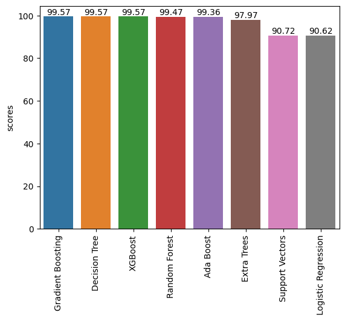

# 🚀 NASA Asteroids Hazard Classification

This project involves building machine learning models to classify whether a Near-Earth Object (NEO) is **Potentially Hazardous** or **Not Hazardous** using data provided by NASA. The dataset consists of various physical and orbital parameters of asteroids, and the goal is to predict hazardous status using supervised learning.

---

* potentially hazardous asteroids: Several asteroids are currently monitored as potentially hazardous due to their size and trajectory, with some posing a risk of impacting Earth in the future. While many potential impactors are identified, the chances of a collision are often low and can decrease with further observation.

* Non-potentially hazardous asteroids: Non-hazardous asteroids are asteroids that do not pose a significant threat of impacting Earth. These are asteroids whose orbits do not come within a certain close proximity to Earth's orbit and are not large enough to cause significant damage upon impact.

---

## Model Results



---

## Dataset Overview

- **Source:** [Information on Asteroids collected from NASA API](https://cneos.jpl.nasa.gov/)
- **Total Records:** 4,687
- **Features:** 40+
- **Target Variable:** `is_potentially_hazardous_asteroid` (0 or 1)

---

## Features Used

Some of the key features used for classification:

- `absolute_magnitude_h`
- `estimated_diameter_min_km`, `estimated_diameter_max_km`
- `relative_velocity_km_per_sec`
- `miss_distance_kilometers`
- `orbiting_body`, `eccentricity`, `semi_major_axis`, `inclination`
- And several others after feature selection & encoding

---

## Models Trained

| Model               | Accuracy | Precision | Recall | F1-Score |
|--------------------|----------|-----------|--------|----------|
| **Gradient Boosting**     | 99.57%   | 1.00 / 0.98 | 1.00 / 0.99 | 1.00 / 0.99 |
| **Decision Tree**         | 99.57%   | 1.00 / 0.98 | 1.00 / 0.99 | 1.00 / 0.99 |
| **XGBoost**               | 99.57%   | 1.00 / 0.98 | 1.00 / 0.99 | 1.00 / 0.99 |
| **Random Forest**         | 99.47%   | 1.00 / 0.98 | 1.00 / 0.99 | 1.00 / 0.98 |
| **AdaBoost**              | 99.36%   | 1.00 / 0.97 | 0.99 / 0.99 | 1.00 / 0.98 |
| **Extra Trees**           | 97.97%   | 0.99 / 0.94 | 0.99 / 0.93 | 0.99 / 0.93 |
| **Logistic Regression**   | 90.62%   | 0.99 / 0.63 | 0.90 / 0.97 | 0.94 / 0.76 |
| **Support Vector Classifier** | 90.72% | 0.99 / 0.64 | 0.90 / 0.94 | 0.94 / 0.76 |

> Models like Gradient Boosting, Decision Tree, XGBoost, and Random Forest achieved **near-perfect results**, indicating high separability between the two classes using selected features.

---

## Evaluation Metrics

All models were evaluated using:

- **Confusion Matrix**
- **Accuracy**
- **Precision**
- **Recall**
- **F1-Score**
- **Macro and Weighted Averages**

---

## Tech Stack

- Python
- Pandas, NumPy
- Scikit-learn, XGBoost
- Matplotlib, Seaborn
- Jupyter Notebook

---

## How to Use

1. Clone the repository:
   ```bash
   git clone https://github.com/yourusername/nasa-asteroid-classification.git


